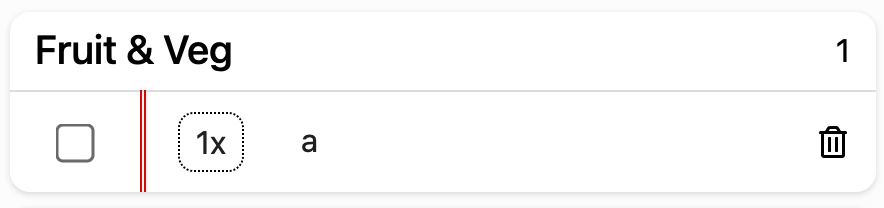

# MS2: Shoppr

Interactive Front-End Web Development Project Submission

## Access

View the project live: [here](https://rbsam176.github.io/ms2-Shoppr/)

View the Github repo: [here](https://github.com/rbsam176/ms2-shoppr)

## Table of Contents
* [Strategy](#Strategy)
	* [User Stories & Project Objectives](#user-stories--project-objectives)
* [Scope](#scope)
	* [Current Features](#current-features)
	* [Long-term Vision](#long-term-vision)
* [Code Walkthrough & Challenges](#code-walkthrough-and-challenges)
	* [Auto-suggest](#auto-suggest)
	* [Web Storage API (localStorage)](#web-storage-api-localstorage)
	* [Import/Download](#importdownload)
	* [Email](#email)
	* [Automatic Collapsing of Tables](#automatic-collapsing-of-tables)
	* [Toggles](#toggles)
* [UX](#ux)
	* [Visual Structure](#visual-structure)
	* [Wireframing & Development Journey](#wireframing-and-development-journey)
	* [Colour](#colour)
	* [Animation](#animation)
	* [Typography/Icons](#typographyicons)
* [Accessibility](#accessibility)
	* [Interactive Elements](#interactive-elements)
* [Technologies Used](#technologies-used)
* [Resources](#resources)
* [Testing](#testing)
	* [Manual testing](#manual-test-cases)
    * [Validation](#validation)
    * [Lighthouse](#lighthouse)
    * [Accessibility Testing](#accessibility-testing)
* [Deployment](#deployment)
* [Final Product (Before/After)](#final-product-beforeafter)
* [Credits & Attributes](#credits--attributes)

## Strategy

### User Stories & Project Objectives
*"As a user..."*

  

I want to be able to customise the names of each section so I have flexibility of how my list is organised

Most shopping list apps will allow you to choose from a pre-determined list of categories, often in food groups. Based on my own experience, I prefer to organise my list by the name of the section in the supermarket, and in order of the store layout. Allowing editable headers grants the user flexibility to decide how best to organise their shopping list.

 

 
I don't want to have to keep changing preferences every time I visit

 Rather than the website losing any changes the user has made upon each visit, the app should remember the changes made to prevent the user repeating themselves every visit.

 

 
I want to be able to save and share my list so I can revisit a previous list or send it to someone else who will do the shopping

 From my own experience, I like creating a shopping list on my computer and then viewing it on my smartphone while I'm in the supermarket. By offering an option to share the shopping list, not only can the user share it to a friend or family member, but they can share it to themselves for cross-device viewing.

 

 
I want to be able to quickly identify where I need to input information so I can quickly generate a shopping list

 In order to promote frequent reuse of Shoppr, the experience should quick and simplified. A lot of content such as Settings, Email input and the shopping list tables are collapsed by default and are revealed when the user needs them. This ensures that what is visible on screen is the essential information needed to operate the app rather than bloating it with content not needed at all times.

 

### Scope

#### Current Features
* Simple, quick, web-based shopping list app with a design that doesn't distract from the main content that has the users focus
  * Where possible, reducing the number of times the user leaves the keyboard. One example of this is binding the enter key to save text input (eg. location name editing, email sending)
* Optimised for mobile, both visually and how it operates by reducing the need to scroll up/down to see content in between adding items
   * This is achieved by using modal popups on mobile when adding an item, rather than the user having to scroll down to the shopping list to verify the item was added successfully
* Remembers items names that have been entered previously and will suggest them when the user begins to type the same item name
* Ability to view at a glance how many items are within each table, updating automatically when items are checked/removed, or when a table is 'completed'
* Automatic opening/closing of tables when an item is added or a table is 'completed'.
  * This feature optimises how much is visible at one time on screen by not displaying everything at once and instead showing each table individually. This is particularly useful on mobile where screen space is not as expansive as on a desktop.
* Location names can be edited, and these changes will be remembered for future visits
* The shopping list can be downloaded to the user's device for future reuse
* Sharing the list can also be emailed as an attachment, useful for sharing with others or so the user can open the same list on another device
  * This was made possible by the EmailJS API, allowing me to pass through HTML and a file to the email template being sent to users.
  * Email template matching the design of the website, and providing a link if the attachment is missing
* Importing of the shopping list in CSV format
* Permitting the user to reset or toggle off features such as auto-suggest, clearing the suggestions, erasing the shopping list or resetting the location names back to default.
  * Remembering the toggle selection that the user made for auto-suggest on future visits
* A useful 'Help' button which details the main features of Shoppr in case the user hasn't used similar apps in the past

#### Long-term Vision
* Currently the project reads and writes to/from the DOM for a lot of its manipulation. During the development of Shoppr I read about different models of structuring code, such as MVC (Model, View, Controller). Having read how this model works, an ambition for a future release would be to refactor the code to operate independently of what is written to the DOM.
  * In addition to this, though I have tried to make my code as modular as possible, I would like to expand on this further and reuse a lot more code than I currently am.
* I would like to include the option for the user to be able to save their shopping list to memory, rather than it being cleared on every refresh. Currently this is not an option by choice, as I want to promote the export/import features and I personally prefer to start from fresh on each visit. Having said that, I see no reason why this couldn't be a feature that is toggled on/off by the user, and this would certainly be easier to implement after adopting a model such as MVC.
* Potentially including a button within the emailed version of the shopping list that will directly import the list back into Shoppr, rather than the user importing the CSV file.
* Despite scoring 99 for Accessibility on Google lighthouse, improvements can still be made to Shoppr for accessibility users. For example, when you add an item you would typically see a modal popup informing the user that the item was successfully added, however visually impaired users wouldn't be notified by this modal in the current release.
* For those who visit multiple supermarkets, it would be useful to have an option to save the location names as a kind of 'profile', so the user could select 'Tesco' or 'Waitrose' and the location names would be set for each supermarket.
* Currently the auto-suggest feature will learn new items that the user has input and will only suggest them on the next visit. For a future release I would like to conduct user experience surveys to gauge how people are responding to Shoppr in general, but one of the things I would like to research is whether people prefer that their item is immediately presented in auto-suggest or if it makes more sense for it to only start on the next visit.
  * I would also like to survey users with their feedback on the design, specifically around the location buttons text and how it has been aligned. Currently the alignment is centred but offset by the width of the edit icon so that it appears centred relative to the header ("Select item location")
* The Auto-suggest feature will filter out duplicate items but it is not handling case sensitivity. A future release should convert the values to all lower case, check for duplicates and then apply any case conversions.
* The user experience on a mobile device would be refined further, in a future release I would like to consider a new approach to adding items. Currently the user must type in the item name, dismiss the keyboard and tap on the location button to input the item to the shopping list. This can be cumbersome if the user is adding numerous items. Another approach that might remedy this would be for the user to select the location first, which would lock it as the selection, and the user could then type in the item name and press enter on their keyboard to input it into the shopping list. This would mean the user could avoid having to dismiss the keyboard on every item input.
* The main banner image above the shopping list is currently a series of varying colours of the same image. This is intentional as the user can edit the location names this mean hard-coding a specific image of a food product for example would not make sense if the user changed the name to something completely unrelated to the image.
  * A future implementation could include using an API from an image hosting service such as Unsplash and allowing the user to select a banner image themselves that matches what they have renamed their location to.

## Code walkthrough and challenges

Most of the code is wrapped into individual functions which I've tried to reuse as much as possible to reduce repeating of code. As mentioned above, in a future release I would like to adopt a model such as MVC so that the operations of the project can exist outside of the visual representation that the user sees. In its current form, most of the time when a function needs to check for the presence of something, such as an item, it will use jQuery to inspect the DOM. When the user adds an item, it is sent through a constructor function which turns it into an object where each object contains the item name, quantity and location it belongs to in the list.

### Auto-suggest
The auto-suggest feature is using a widget from the jQuery UI library. It accepts an array as its source and will present options when a user begins to type the name of an item that is listed in the array. Every time a user adds an item on Shoppr, or imports a shopping list CSV file, it will save the items to memory so when the user next visits the site they will see the item appear in a dropdown when they begin to type the items name. The variable `items` represents the item objects stored in localStorage (named `inputObjects`), whereas `itemNames` acts as an array of just the item names that is fed to the autocomplete widget source.

### Web Storage API (localStorage)

The auto-suggest feature, along with the remembering of location names, and whether the auto-suggest feature is enabled or not within the settings panel is made possible by the use of the web storage api. Using the 'localStorage' property, I have saved the data that should be remembered for future visits to the users browser storage, and before this data is pushed to the array it is sent through a function which checks for duplicates so only unique values are presented to the user. I decided not to have the shopping list itself committed to memory as I felt a deliberate action of downloading/emailing the list would be a better experience for the user, so they didn't need to clear the list on every visit if they didn't need the previous items. As noted in the 'Long-term Vision' section of this readme, I would not rule this option out in a future release linked to a toggle switch that could be enabled and disabled by the user.

### Import/Download

Using the web storage API presented an interesting UX challenge. Personally, I prefer to make a shopping list on my computer and then have it visible on my smartphone for portable use walking around the supermarket. However, the data that is saved from Shoppr is local to the device the user is using, so there needed to be a way to transfer this data to another device. I decided to offer the user two options to do this, one is to download the shopping list as a CSV, and the other to send the shopping list and an attachment of the CSV by email. The download option was possible by encoding the CSV file as a 'data URL', so when the user clicks the button jQuery will assign the href to the URL and trigger a download in the users browser. Having these exporting options allows for the most flexibility, as the user could make a shopping list of just essential items and download it to be used a template for future shopping lists to be built upon. It also permits the user to email the list to themselves to be accessed on another of their devices which in turn can be imported back into Shoppr. The CSV not only contains the list of items and their respective tables, but the names of the locations as well.

### Email

I used the EmailJS API to generate emails to be sent to the user upon request a copy of the shopping list. I wanted the email to match the design of the website to keep the experience consistent and seamless regardless of the platform they're interacting with Shoppr on. This meant passing through HTML code with inline CSS to the EmailJS message parameter. I was also able to design a simplified version of the shopping list to be visible as a table within the email for quick viewing. 

As Shoppr uses 'Font Awesome' for its icons, I was able to embed this into the email template. However I soon discovered that not all email clients, such as Gmail, support external resources within emails, instead I added image versions of the icons to the project repo and passed these through to the email template which provided the same visual appearance.

While sending text through via EmailJS's API was covered in the Interactive Front-End Web Development module, I wanted to go further by including an attachment of the users shopping list as a CSV file. I read through the documentation section on attachments and read that attachments can be Static, meaning it is a fixed file sent to everyone, or dynamic, which was more suited to Shoppr as it was a different CSV being created by the user on every request. The 'Variable Attachment' section of the EmailJS documentation states that the file can be passed in base64 format and you can use the 'btoa' method to convert a string into this format. After reading the w3schools section on how to use this method, I was able to convert the CSV string into a base64 format and pass it through to the API parameter.

While this appeared to work at first, I soon discovered that when viewing the emails on an iOS device using Apple's default email client the attachments appeared to be missing. After researching online why this could be happening and not finding any answers I decided to contact the developer to see if it could be an issue with EmailJS. The developer confirmed this was a known issue and wasn't able to provide a resolution. 

To resolve this, I wanted to include a link for anyone experiencing issues with the attachments not appearing so that they would still be able to download the file. I knew that earlier in the project I had used a method to encode the CSV to a 'data URL' that is used when the user clicks the Download button, so I used the same url and passed it through to the email template. This didn't immediately work as whenever I clicked on the link on either my computer or my smartphone the email client didn't know where to open the file, it didn't know to open the browser which would trigger the file to be downloaded. To get around this limitation, I set the link to take the user to the Shoppr URL followed by a hash symbol and the data URL. This didn't own its own trigger the download, but within jQuery's '(document).ready' I was able to have Shoppr always check if the current URL contained "data:application/octet-stream", if it did then it triggered the download and presented a modal popup with the option for the user to download it again if they needed to.

### Automatic collapsing of tables

I decided to restrict the shopping list table to by default only show one at a time. This meant on devices that didn't have a lot of screen space, such as on a smartphone, you could concentrate on one table at a time. When all items are checked in a table, it automatically closes, turns green, marks itself as 'Completed' and loops through the remaining tables to see which is the next table containing an unchecked item. If none of the remaining tables contain unchecked items it start the loop sequence from the top of the shopping list. The intention behind including this was that the user would start from the top of the list which would be in order of how their supermarket layout and begin to check through each item until all tables are collapsed and marked as 'Completed'. This almost adds an element of gamification to the app, as it influences the user to want to get to the point where everything is closed and green.

### Toggles

Throughout Shoppr there are multiple use of toggles. As I wanted the design to be as minimal and fast as possible, I wanted to avoid having unnecessary buttons where possible. This meant that rather than having for example one button to open all tables and another to close all, it would become one button that changed on each click. jQuery can make this easier by using `.collapse()` but I noticed that if a user clicked twice on a button quickly then it would become mismatched with the state it was supposed to be in. I overcame this by running the click of the button through an if statement which checked what icon was currently available before switching to the next toggle state. An area of improvement for a future release is with the 'Open All/Close All' toggle button, currently if the user were to set it to open all tables and then manually close them all, it would not reflect the correct toggle state. One way to resolve this would be to have the manual closing of a table run a loop through all tables to verify if all were closed and then change the toggle state of the button. However for a future release I think it would be better to do more research on 'states' rather than to hard-code it into every conceivable user interaction that would need the toggle to change.

## UX

### Visual Structure
 
I wanted the user to feel like Shoppr was more of an app, than a traditional website. One of the main ways I have tried to achieve this is by not using a traditional website structure such as header, navigation, content, footer. This is because Shoppr is designed for frequent reuse, and as a result I wanted the first element of the site that the user interacts with to be immediately visible. It is intentional that the only image on display is part of the shopping list, as I wanted the user journey to lead them to colour. For desktop users, I also wanted their input to be immediately visible by having their interactions take place on the left half of the display, and the results of their interaction appearing on the right. 

This presented an interesting challenge on how to provide this validation for mobile users. What would the best way to let the user know they've inputted an item successfully be on a smaller screen size?

The original design attempted to resolve this by the window automatically being scrolled down to the shopping list tables when the user has inputted an item. An plus icon only visible on mobile would appear allowing the user to be scrolled back to the top to be able to input another item.

While this resolved the issue of the user knowing their item was added successfully, it didn't make it immediately obvious that the user was being scrolled and not taken to another page. After discussing this with my mentor, we came to the conclusion that removing the automatic scrolling and instead including a modal popup only on mobile would be the better solution.

A reoccurring visual theme to Shoppr is its use of collapsing menus. The settings button, shopping list tables and email button also collapse to reveal more information. I made this decision so I could maximise how much can be visible at one time, rather than presenting everything at once and requiring the user to scroll a lot more.

### Wireframing and Development Journey

The first stage of the project was creating a wireframe of the design using Balsamiq. This acted as a great starting off point which heavily influenced the overall structure and style of Shoppr. As a wireframe is just the skeleton of a design, it didn't feature any colour or images, but I decided to keep this in the final design as it serves the design well by allowing the elements that required user interaction to be immediately visible and at the centre of attention.

The wireframe design differs in a few notable ways. From the beginning I was already thinking about how to communicate with a mobile user when they add an item so they know it was added successfully. A mobile screen size is too small to show both the input field and shopping list so I need to separate the two without keeping the user in the dark. The original mockup included a separate table of the items in order of the most recent item added by the user. While this did solve the problem of validating the users input was successfully registered, it was difficult to fit both the input fields and this table without the user having to scroll down. The second attempt was to have the user automatically be scrolled down to the shopping list every time they added an item. This would also present a + button that would scroll the user back up to the top so they could input another item. However, as not all devices support smooth scrolling, it wasn't immediately obvious that the sudden jump up and down was scrolling instead of directing the user to another page of the website. It also slowed down the time it takes adding a long list of items, as every input required the user to locate and click the + button. The final iteration which is demonstrated in the deployed version of Shoppr is a simple modal popup that is only visible on mobile which informs the user of the item name and location that they just input into the shopping list.

Through the development of Shoppr I was very critical of which features were needed and which should be cut in order to keep the user experience quick and as simplified as possible. I decided to remove both the 'favourite' buttons and 'archive' section which is visible in the original wireframe. The original intention for allowing the user to 'favourite' an item was to allow them to have a list of essential items which they could input all at once with a single click. The archive presented which items were marked as 'favourite' and allowed the user to remove them if necessary. I decide to remove this as I felt having multiple tables confused the design and, crucially, as the locations are editable by the user it meant adding 'favourited' items wouldn't always match the table titles if they had since been modified by the user. I still liked the idea that the user could have a set of items that could be added quickly if it were items frequently bought, so this evolved into the current design which features an Import and Download button. Allowing the user to download their shopping list means they can create templates of the essentials items which can be used as the basis for future lists to be built upon. The downloaded lists also remember the table titles so every item still belongs to the correct location. 

*Click the image to see it full-size.*  

### Colour

I didn't want Shoppr to have a specific accented colour, and instead wanted to reflect the fact that a shopping list is a list of numerous diverse items. I decided a multi-coloured, almost rainbow-like accent would best represent this, and as mentioned above, I drew inspiration from the bareness of the wireframe mockup and wanted to extract all colour from the design and only feature colour in areas that needed the users attention. You can see only four areas of the design that feature colour.
  * Location buttons: this button would be the most frequently clicked element as it sends the users input to their shopping list. The colour serves as a symbolic and subliminal message to the user that something happens at this point as it's the first instance of colour appearing.
  * The next instance of colour is the final destination of the user journey, the hero banner wrapping the results of the users interactions in the form of the shopping list table. Each hero banner matches the colours attached to the corresponding location buttons to keep the journey consistent, while the table features a double red line to mimic a traditional notepad which further affirms that it is a shopping list being added to.
  * Any alerts that show on Shoppr, for example, validation for mobile users that their item has been added successfully, will always need to demand attention as their native state is to be hidden and as such, this element is deserving of colour. 
  * Lastly, a button only visible for mobile users that is located at the bottom of the shopping list and serves as a useful way to take the user back to the top so they can add an additional item. This is the last element visible for a mobile user and deserved to stand out as a kind of 'finish line'.

### Animation

* Mouse-over hover effects added to all buttons to inform the user that the element is a clickable button

* Hidden interactive elements such as a table or the settings panel collapsing will slide in rather than abruptly appearing

* While hidden informational alerts such as the 'Help' guide and modal alerts will fade in and out 

### Typography/Icons 

| Useage              | Source                        |
|:--------------------|:------------------------------|
| Shoppr logo icon           | [FontAwesome](https://fontawesome.com/icons/shopping-basket?style=solid) |
| Help icon | [FontAwesome](https://fontawesome.com/icons/info-circle?style=solid) |
| Settings default icon | [FontAwesome](https://fontawesome.com/icons/cog?style=solid) |
| Settings collapsed icon | [FontAwesome](https://fontawesome.com/icons/level-down-alt?style=solid) |
| Toggle icon on | [FontAwesome](https://fontawesome.com/icons/toggle-on?style=solid) |
| Toggle icon off | [FontAwesome](https://fontawesome.com/icons/toggle-off?style=solid) |
| Clear Auto-suggestions icon | [FontAwesome](https://fontawesome.com/icons/align-left?style=solid) |
| Empty Shopping List icon | [FontAwesome](https://fontawesome.com/icons/trash-alt?style=solid) |
| Reset Item Locations To Default icon | [FontAwesome](https://fontawesome.com/icons/undo-alt?style=solid) |
| Location Title Edit icon | [FontAwesome](https://fontawesome.com/icons/pencil-alt?style=solid) |
| Location Title Save icon               | [Font Awesome](https://fontawesome.com/icons/check?style=solid)           |
| Open All icon | [FontAwesome](https://fontawesome.com/icons/level-down-alt?style=solid) |
| Close All icon | [FontAwesome](https://fontawesome.com/icons/level-up-alt?style=solid) |
| Remove Item icon | [FontAwesome](https://fontawesome.com/icons/trash-alt?style=solid) |
| Upload icon | [FontAwesome](https://fontawesome.com/icons/upload?style=solid) |
| Download icon | [FontAwesome](https://fontawesome.com/icons/download?style=solid) |
| Email icon | [FontAwesome](https://fontawesome.com/icons/paper-plane?style=solid) |

## Accessibility

### Interactive elements
Extra attention was made to ensure all interactive elements had aria-labels, totalling 38. I loaded Shoppr on my iPhone and enabled VoiceOver to experience how the project operated without visual indications.

## Technologies Used

| Technology  | Use                             |
|:------------|:--------------------------------|
| HTML        | Content                         |
| CSS         | Styling                         |
| [Bootstrap](https://getbootstrap.com)   | Responsive structure, carousels |
| [FontAwesome](https://fontawesome.com) | Logo and Submit button icons    |
| Git & [Github](https://github.com)| Version Control & Deployment    |
| JavaScript| Interaction    |
| [JQuery](https://jquery.com)| DOM Manipulation    |
| [JQuery UI](https://jqueryui.com/autocomplete/)| Auto-complete feature    |
| [EmailJS](https://www.emailjs.com)| API used for sending emails to users    |
| Google Fonts| ?    |
| Adobe Photoshop| Editing the colour scheme of the hero banner image    |

## Resources

| Resource           | Use                                       |
|:-------------------|:------------------------------------------|
| [Balsamiq](https://balsamiq.com)           | Wireframing                               |
| [VS Code](https://code.visualstudio.com)            | IDE and used for Git version control      |
| [Chrome Dev Tools](https://developers.google.com/web/tools/chrome-devtools)   | For debugging CSS issues                  |
| [Notion](https://www.notion.so)             | Notes & todo list, tracking progress      |
| [W3C HTML Validator](https://validator.w3.org) | Validation of HTML code                   |
| [W3C CSS Validator](https://jigsaw.w3.org/css-validator/)  | Validation of CSS code                    |
| [JS Hint](https://jshint.com)  | Validation of JavaScript code                    |
| [Icons8.com](https://icons8.com/illustrations/illustration/pale-grocery-store)  | Source of hero banner image                    |
| [TablesGenerator.com](https://www.tablesgenerator.com/markdown_tables)  | For easy HTML table creation for readme.md and bugtests.md                    |

## Testing

### Manual Test Cases

As Shoppr has many different features, toggle states, conditional interactions, I felt it was necessary to have an exhaustive suite of test cases to ensure everything operated as it should. This also served as a way for me to ensure introducing a new feature didn't inadvertently cause issues elsewhere.

[Click here to see the full suite of test cases.](/bugtests.md)

### Validation
<a href="https://validator.w3.org">*</a> 

> The only warning that was flagged was 'possible misuse' of an aria label on a div. However, this div's text represents the current quantity of the item the user is about to input, so I believe it needs this aria-label for accessibility users.

<a href="https://jshint.com/">*</a>

> *The project passed the JS Hint validator with the configuration set to allow 'New JavaScript features (ES6)'. The only issue raised during the final validation is 'emailjs' being an undefined variable. This is because JS Hint does not know that in the HTML document it is linking to a CDN for Email JS and so doesn't recognise that `emailjs.init` or `emailjs.send` are not meant to be variables.

### Lighthouse

> Mobile Performance score 88 partially due to images not being served in next-gen formats such as JPEG-2000 but I have avoided this in order to maintain cross-browser compatibility.

### Accessibility Testing

Using my iPhone I was able to verify that the accessibility tags and labels were correctly applied to all elements to ensure the user experience for any user was the best that it could be. I also used Lighthouse as a guide and actioned any suggestions it made to make Shoppr more accessible.

## Deployment
* Most development was written while on a 'develop' branch
* Occasional periods of experimentation would be performed on a separate branch to prevent causing any issues with the existing code
* At the end of the development before the first public release, all code was put into the 'master' branch, pushed to the remote repo on GitHub and deployed using GitHub Pages for public use.

## Final product (Before/After)

Below are examples of how it looked throughout development:  

### First draft 

#### Desktop

  

#### Mobile

### Final release

#### Desktop

 
 

#### Mobile

## Credits & Attributes
* [Icons8](https://icons8.com/illustrations/illustration/pale-grocery-store) as the source of hero banner image
* Bootstrap Documentation
* W3 Schools Documentation for HTML, CSS, JavaScript
* Mozilla Documentation for JavaScript
* JQuery Documentation
* JQuery UI Documentation
* StackOverflow question solving an issue I faced with applying a border to hover state only without it shifting nearby elements. [Link to solution.](https://stackoverflow.com/a/9612782)
* StackOverflow question solving an issue I faced with applying a multicoloured border [Link to solution.](https://stackoverflow.com/a/38850580)
* StackOverflow question providing a CSS-only solution to toggling icons on a collapsing element [Link to solution.](https://stackoverflow.com/a/39405065)
* W3 Schools example demonstrating an easy way to centre an element [Link to solution.](https://www.w3schools.com/css/css_align.asp)
* W3 Schools example demonstrating a way to increase the size of a checkbox [Link to solution.](https://www.w3schools.com/css/css3_2dtransforms.asp)
* StackOverflow answer demonstrating how to use jQuery to trigger another button to click [Link to solution.](https://stackoverflow.com/questions/38095542/jquery-click-gives-me-stack-size-exceeded/38095783#38095783)
* StackOverflow answer demonstrating how to apply a function to a dynamically generated element [Link to solution.](https://stackoverflow.com/questions/12602711/action-not-triggered-with-checkbox-created-dynamically/12602806#12602806)
* StackOverflow answer citing W3Schools demonstrating how to use an if statement to check if a checkbox is *not* checked [Link to solution.](https://stackoverflow.com/questions/8846075/css3-unchecked-pseudo-class)
* StackOverflow answer demonstrating how to override JQueryUI's Autocomplete source to empty array [Link to solution.](https://stackoverflow.com/questions/24098907/how-to-clear-and-add-source-data-dynamically-in-jquery-autocomplete/24099610#24099610)
* StackOverflow answer demonstrating how to trigger a function on a keypress [Link to solution.](https://stackoverflow.com/questions/302122/jquery-event-keypress-which-key-was-pressed/302154#302154)
* StackOverflow answer demonstrating how remove the contents of an element that has been created dynamically [Link to solution.](https://stackoverflow.com/questions/170997/what-is-the-best-way-to-remove-a-table-row-with-jquery/171293#171293)
* Bootstrap documentation example demonstrating how to trigger a function after a collapse animation has completed [Link to solution.](https://getbootstrap.com/docs/4.0/components/collapse/)

### [Back to top.](#)